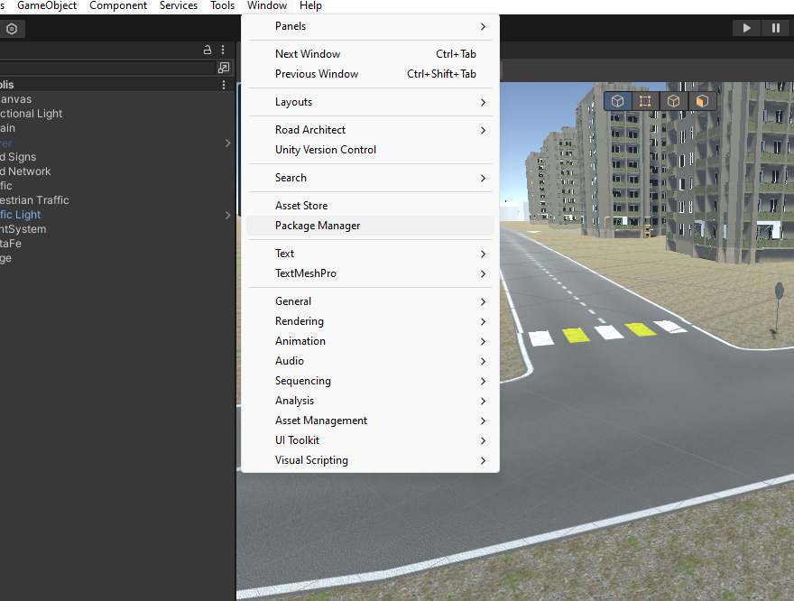
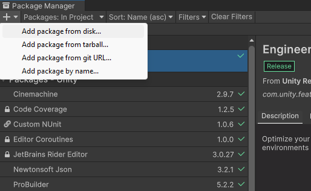

# ProBridge Package

This documentation provides a comprehensive guide on how to integrate the ProBridge package, which contains essential scripts for connecting simulators to ROS (Robot Operating System), into your Unity project.

## Prerequisites

Before you begin, ensure you have the following:

- Git installed on your computer.
- Unity Editor 2018.4 or later installed and ready to use.

## Installation Guide

### 1. Accessing Package Manager in Unity

Next, you need to open Unity and access the Package Manager:

- Launch Unity and open your project.
- Go to `Window` > `Package Manager` to open the Package Manager window.

### 2. Adding Package from git URL

Within the Package Manager:

- Click the `+` button in the top left corner.
- Select `Add package from git URL...`.

### 3. Verifying Installation

If the installation process was successful, you should now be able to see `ProBridge` listed among the installed packages in the Package Manager. This confirms the package is ready for use in your project.

